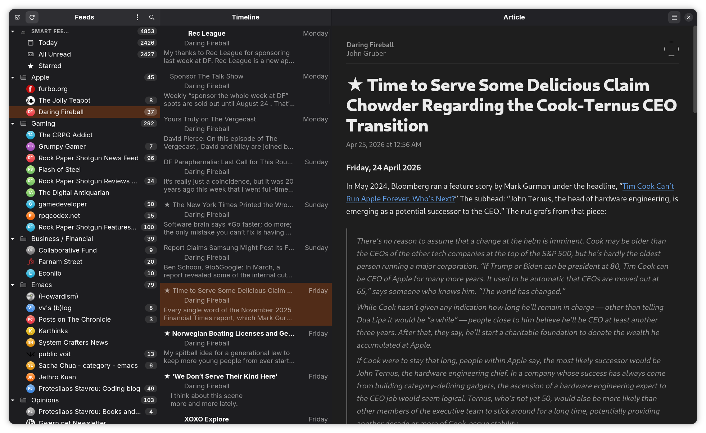
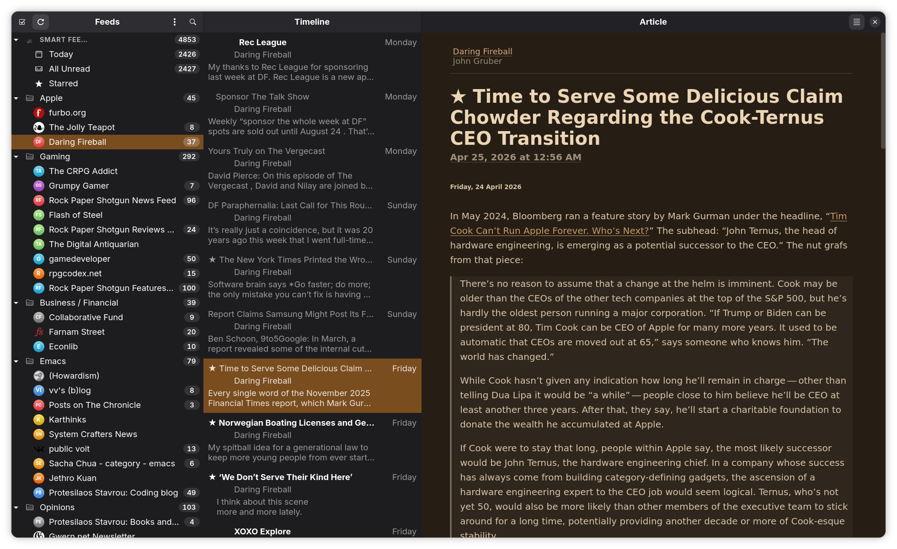

<p align="center">
  
</p>

<p align="center">
  <a href="https://www.rust-lang.org/"></a>
  <a href="LICENSE"></a>
  <a href="https://github.com/Ranchero-Software/NetNewsWire"></a>
  <a href="https://ko-fi.com/bdkl"></a>
</p>

---

# viaduct

**A Linux port of NetNewsWire — the macOS RSS reader by Brent Simmons — in Rust and GTK4.**

Viaduct translates NetNewsWire's local-account architecture, parsing pipeline, and refresh engine to GNOME 50+, faithfully enough that Brent's CSS themes drop in byte-for-byte. The name is the metaphor: a viaduct carries something across a gap. This one carries NetNewsWire across to Linux.

**Author's Note**: I am a broke college student in my late-30s. This was an experiment and not all-encompassing. It only supports local and Inoreader because that's what I use. I've only tested this up to 150 actual feeds because that's how many I follow. I use Fedora 44, my laptop is a Thinkpad T14 AMD Gen 6. I welcome contributions but can only truly test for my specific use-case.

## Why this exists

Modern feed readers tend to be Electron / browser-engine apps with sprawling memory footprints. The closest comparable Linux RSS reader idles at **600 MB** with the same OPML file Viaduct peaks at under **300 MB**. Viaduct gets there by porting NetNewsWire's discipline — single-writer SQLite worker, OPML on disk as the source of truth, FTS5 search, hard 250-entry per-kind LRU caches, exactly one neutered WebKit instance for the article pane — into Rust + tokio + GTK4. Idle target: 100–300 MB. Hard peak ceiling: 500 MB, enforced by an in-tree `mem_check` harness.

## Features

| Feature | Notes |
|---|---|
| **NetNewsWire-faithful parsing** | RSS 2.0, RDF, Atom, JSON Feed, RSS-in-JSON. Permissive `DateParser` ported from `RSDateParser`. CDATA, `xhtml`-typed Atom content, `<media:*>` namespace, MD5 synthetic IDs. |
| **Local + Inoreader accounts** | Local OPML-on-disk account; Inoreader sync engine ported from NNW's ReaderAPI. Other remote sync engines deliberately out of scope. |
| **Smart Feeds** | Today / All Unread / Starred — virtual feeds via SQLite + FTS5 queries. |
| **Single-writer DB worker** | Every SQLite write funnels through a dedicated tokio task. The GTK thread never blocks on I/O. |
| **Locked-down WebKit pane** | One `WebKitWebView` for article rendering. JS / WebGL / WebRTC / DevTools / LocalStorage / IndexedDB all OFF. Strict CSP routes images through a custom `viaduct-img://` URI scheme so the WebView gets zero direct internet access. |
| **All 8 NetNewsWire themes** | Sepia, Appanoose, Biblioteca, Hyperlegible, NewsFax, Promenade, Tiqoe Dark, Verdana Revival — bundled byte-for-byte via `include_str!`, plus an Adwaita theme for system-native feel. |
| **App-wide accent unification** | Selected theme's accent color propagates across the GTK chrome (sidebar selection, focus rings, switches, suggested-action buttons) via a CSS provider that beats GNOME 47+ system-accent integration. |
| **Adaptive layout** | `AdwBreakpoint`s collapse the three-pane split at 900sp / 600sp into mobile-style navigation stacks. Same code, every form factor. |
| **Reader View** | Local readability extraction (no Mercury / external service), gated behind a 5MB input cap and disk-cached. |
| **Video thumbnails + in-pane playback** | YouTube + Vimeo detection in feed bodies. Thumbnails in the timeline; opt-in playback in a sandboxed dialog WebView (separate from the article pane's locked-down instance). |
| **Keyboard shortcuts** | NetNewsWire's bindings, plus `Ctrl+Shift+C` copy URL, `Ctrl+Shift+R` toggle reader, `Esc` close article, `Ctrl+N` add feed, `Ctrl+?` cheat sheet. |
| **Add Feed dialog** | Paste a feed URL or a website URL — a port of NNW's `FeedFinder` runs the two-pass discovery (parse-as-feed → fall back to scanning HTML `<link rel="alternate">`). Optional name + folder placement. |
| **Right-click context menus** | Sidebar feed rows: Mark All Read / Refresh / Copy Feed URL / Delete (destructive-styled confirm). Sidebar folder rows: Mark All Read. Timeline rows: Toggle Read / Star / Open in Browser / Open Enclosure / Copy URL. |
| **Auto-sync** | Optional refresh-on-open + periodic refresh (Never / 15 min / 30 min / 1 h / 2 h / 6 h / Daily). Background-while-window-closed mode planned — see `docs/background-service-plan.md`. |
| **OPML import/export** | NetNewsWire-shaped serialization, byte-for-byte compatible with `OPMLExporter`. |
| **The Pruning Engine** | Age-based article purge, orphaned-author cleanup (NNW issue #5232), startup VACUUM on the worker thread. |

## Screenshots

Captures from Fedora 43 / GNOME 50 / Wayland in dark mode, three-pane wide layout.

<p align="center">
  
</p>

<p align="center">
  <em>Adwaita theme — system accent colour, libadwaita-native typography</em>
</p>

<p align="center">
  
</p>

<p align="center">
  <em>Sepia theme — warm cinnamon accent propagates across the chrome (selected timeline row, sidebar selection, focus rings)</em>
</p>

The AppStream metainfo (`data/org.virinvictus.Viaduct.appdata.xml`) also lists screenshots — those are the ones gnome-software / Flathub display on the install page, so keep both in sync when adding new captures.

## Installation

Viaduct targets **GNOME 50+ / GTK 4.16 / libadwaita 1.7** on Wayland. The Flatpak (when shipped to Flathub) bundles every system dependency. Source builds need the development headers below.

### Build dependencies (source)

| Library | Version | Fedora package | Debian/Ubuntu package |
|---|---|---|---|
| GTK4 | ≥ 4.16 | `gtk4-devel` | `libgtk-4-dev` |
| libadwaita | ≥ 1.7 | `libadwaita-devel` | `libadwaita-1-dev` |
| WebKitGTK | 6.0 | `webkitgtk6.0-devel` | `libwebkitgtk-6.0-dev` |
| SQLite (bundled) | — | — | — |
| TLS | rustls (vendored) | — | — |

WebKitGTK 6.0 powers the article reading pane. It's run in a heavily-neutered configuration (JavaScript disabled, no plugins, no local storage, strict CSP) — used purely for CSS typography fidelity. See `spec.md` §2.2 for the threat-model writeup.

```bash
# Fedora 43+
sudo dnf install gtk4-devel libadwaita-devel webkitgtk6.0-devel

# Debian/Ubuntu (24.04+)
sudo apt install libgtk-4-dev libadwaita-1-dev libwebkitgtk-6.0-dev

# Build via Cargo (workspace root):
cargo build --release      # binary lands at target/release/viaduct
cargo run --release        # launch the GTK app

# OR: build via Meson — produces a system-style install layout for
# packagers / Flathub. Mirrors the path Flatpak takes during build:
sudo dnf install meson ninja-build glib2-devel    # Fedora
sudo apt install meson ninja-build libglib2.0-bin # Debian/Ubuntu
meson setup builddir --prefix=/usr -Dbuildtype=release
meson compile -C builddir
sudo meson install -C builddir
```

## Architecture

- **Cargo workspace** with two crates: `viaduct-core` (headless: database, network, parser, models, errors, paths, runtime helpers — no GTK deps) and `viaduct` (binary: GTK4 / libadwaita / WebKit UI). The split makes architectural boundaries a *compile error*, not a code-review rule.
- **Network + data layers** isolated from the UI thread via `tokio` multi-thread runtime. The GTK thread reads in-memory models and posts commands down `mpsc` channels; it never blocks on SQLite or the network.
- **Three databases.** `articles.sqlite` (with FTS5 virtual table), `feed-settings.sqlite` (per-feed cache, conditional-GET state), `sync.sqlite` (Inoreader sync state). All in WAL mode. OPML on disk is the source of truth for the feed/folder hierarchy — *not* SQL — matching NetNewsWire exactly.
- **Single neutered WebKit instance** for the article pane, with all images routed through a custom `viaduct-img://` URI scheme so the WebView never reaches the public internet directly.

Detailed design notes live in `spec.md`. Contributor / agent rules live in `CLAUDE.md`. Per-release changelog lives in `patchnotes.md`. Unchecked roadmap items live in `roadmap.md`.

## Acknowledgements

This project would not exist without **[Brent Simmons](https://inessential.com/)** and the **[NetNewsWire team](https://github.com/Ranchero-Software/NetNewsWire/graphs/contributors)**. Every architectural decision in Viaduct that matters — the three-database split, OPML on disk, the conditional-GET expiry semantics, the special-case domain list, the `RSDateParser` corpus, the article-ID hashing scheme, the eight bundled article themes — is theirs. Viaduct is not a reimagining; it's a translation. NetNewsWire is MIT-licensed and the `.netnewswire/` reference tree is intentionally kept inside this repo (gitignored) so every port decision can be traced back to the canonical source.

If you want a great RSS reader on **macOS or iOS**, please install [NetNewsWire](https://netnewswire.com/) — it is and remains the gold standard. Viaduct is what NetNewsWire would feel like if it ran on Linux.

We also want to give a huge thanks to **[NewsFlash](https://gitlab.com/news-flash/news_flash_gtk)**, the only other RSS reader worth using on Linux. Reviewing their codebase against ours directly informed Viaduct's v2.0 architectural plan (`two-plans.md`, see `roadmap.md` Phase 18). The modular widget decomposition (`SidebarView` / `TimelineView` / `ArticlePaneView`), the dedicated `ArticleRenderer` GObject, and the expanded reactive-property coverage are concepts NewsFlash demonstrates beautifully in pure GTK4 idiom — and we're adopting the parts that compose with our "port don't invent" constraint. Their broader actor-model approach and Blueprint-based UI we ultimately did not adopt (we stay anchored to NetNewsWire's structure for porting traceability), but their work is phenomenal and forced us to ask the right questions about where Viaduct could be more idiomatically GTK without losing fidelity.

## License

MIT. See [LICENSE](LICENSE).

## Support

bc1qkge6zr45tzqfwfmvma2ylumt6mg7wlwmhr05yv
